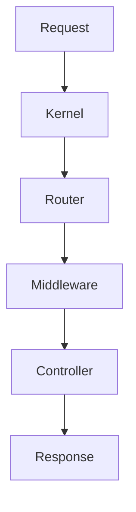

## Solve Framework / CMS

Ini adalah framework yang akan berfungsi sebagai framework yang mempunyai fitur mirip laravel namun dengan beberapa hal yang manual.

## Tujuan

- Hanya tidak ingin terpaku sama laravel dan breaking change
- Biar ngerti aja

### Overview

Framework ini menggunakan pendekatan modular dengan core system
yang ringan dan mudah dikembangkan.

---

## Komponen Utama

- Kernel
- Router
- Middleware
- Controller
- Service Container
- Config Loader

---

## Navigasi

- [Request Lifecycle](#request-lifecycle)
- [Routing System](#routing-system)
- [Middleware](#middleware)

### Request Lifecycle

---

### Routing System
