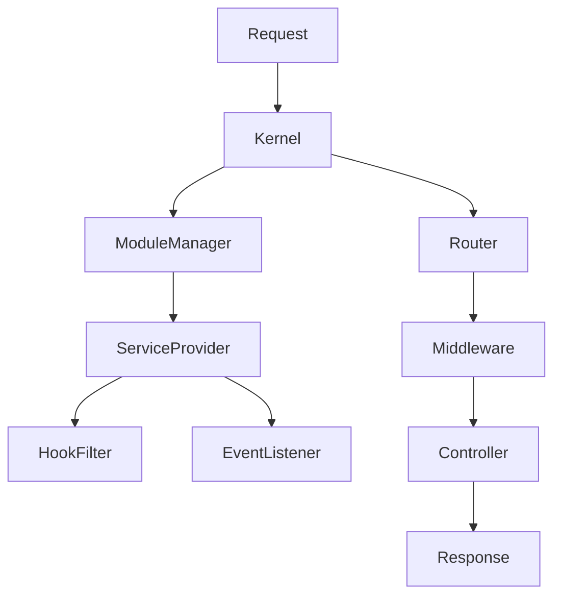

# Solve Framework / CMS

Ini adalah PHP framework yang akan berfungsi sebagai framework yang mempunyai fitur mirip laravel namun dengan tidak terlalu banyak dependancy yang berat dan digunakan sebagai kerangka kerja yang flexible dan tidak terpaku pada satu ekosistem saja.

## Tujuan

- Hanya tidak ingin terpaku sama laravel dan breaking change
- Biar ngerti aja

### Overview

Framework ini menggunakan pendekatan modular dengan core system
yang ringan dan mudah dikembangkan.

### Tech Stack

**Frontend:** Tailwindcss, Vite.js, Vanilla JS, Native CSS & Native PHP.
**Server:** PHP
**Database:** MYSQL

---

## Komponen Utama

- Kernel
- Router
- Middleware
- Controller
- Service Container
- Config Loader
- Hook & Filter Manager
- Event Dispatcher
- Module Service Provider

---

## Helpful Docs

- [Request Lifecycle](#request-lifecycle)
- [Routing System](#routing-system)
- [Middleware](#middleware)
- [Cache](#cache)
- [CLI](#cli)
- [Module System](#module-system)

### Request Lifecycle



---

### Routing System

> Routing system menggunkan 2 file yaitu admin.php untuk bagian dashboard dan web.php untuk bagian public.

### Cache

> Implementasi Cache sudah dilakukan dengan File Driver

### Module System

Setiap module diletakkan di folder modules dan memiliki class Module sebagai service provider:

- register(): mendaftarkan binding, hook, filter
- boot(): menjalankan listener/event saat aplikasi sudah siap

Contoh:

```
modules/CoreCms/Module.php
namespace Modules\CoreCms;
class Module extends App\Core\ServiceProvider
```

## CLI

> Implementasi CLI untuk beberapa hal yang butuh dilakukan seperti pembuatan seeder ke database, pembuatan file startup ketika project dijalankan, Cara Penggunaanya seperti ini :

```
php cli/seed.php
```

## DATABASE MIGRATION

> Implementasi CLI untuk menjalankan migration pembuatan atau penghapusan table database

```
php cli/migration.php ModelMigration
php cli/migration.php ModelMigration down
php cli/migration.php all
php cli/migration.php all down
```

## Dev Server

Command ini menjalankan dev server untuk PHP di folder public, sekaligus menjalankan Vite dev Server npm run dev :

```
php cli/develop.php
```
